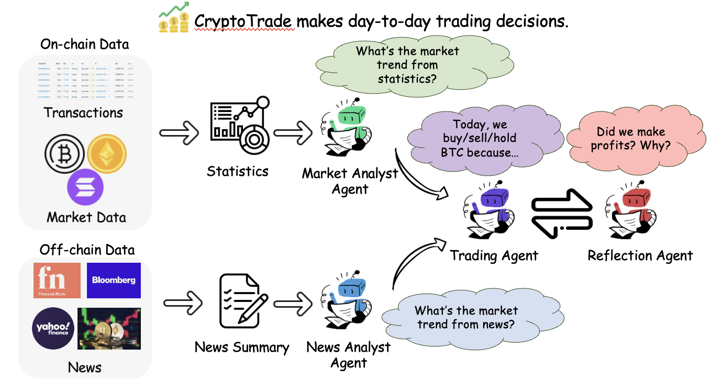

# CryptoTrade: A Reflective LLM-based Agent to Guide Zero-shot Cryptocurrency Trading
This work aims to bridge the gap by developing an LLM-based trading agent, CryptoTrade, which uniquely combines the analysis of on-chain and off-chain data. This approach leverages the transparency and immutability of on-chain data, as well as the timeliness and influence of off-chain signals, providing a comprehensive overview of the cryptocurrency market. CryptoTrade incorporates a reflective mechanism specifically engineered to refine its daily trading decisions by analyzing the outcomes of prior trading decisions. This research makes two significant contributions. Firstly, it broadens the applicability of LLMs to the domain of cryptocurrency trading. Secondly, it establishes a benchmark for cryptocurrency trading strategies. Through extensive experiments, CryptoTrade has demonstrated superior performance in maximizing returns compared to traditional trading strategies and time-series baselines across various cryptocurrencies and market conditions.

## Overview
<p align='center'>
  
</p>

## Requirements
We list main requirements of this repository below. 

- openai==1.30.5
- torch==2.3.0
- torch-cluster==1.6.1+pt20cu117
- torch-geometric==2.3.0
- torch-scatter==2.1.1+pt20cu117
- torch-sparse==0.6.17+pt20cu117
- torch-spline-conv==1.2.2+pt20cu117
- torchaudio==2.0.1+cu117
- torchmetrics==0.11.4
- torchvision==0.15.1+cu117
- transformers==4.30.2

## Running CryptoTrade
  ``` 
  ./run_agent.sh
  ```

## Example Output
We provide an example output of ETH in a bull market condition using GPT-4 after running the run_agent.sh file.

  ```
  Namespace(dataset='eth', model='gpt-4-turbo', to_print=1, starting_date='2023-10-01', ending_date='2023-12-01', price_window=7, reflection_window=3, seed=6216, use_memory=False, use_tech=1, use_txnstat=1, use_news=1, use_reflection=1, resume_dir='', start_trial_num=0, num_trials=1, num_envs=1, run_name='eth_run', is_resume=False)
  
  *** START STATE ***
  {'cash': 500000.0, 'eth_held': 299.2222096876044, 'open': 1670.998956, 'net_worth': 1000000.0, 'roi': 0.0, 'today_roi': 0.0, 'technical': {'macd_signal': 'sell'}, 'txnstat': {'unique_addresses': 501396, 'total_value_transferred': 8.6282e+23, 'total_gas_used': 108230000000.0, 'successful_transactions': 954345, 'total_transactions': 977771, 'average_gas_price': 11215628851.0}, 'date': '2023-10-01 00:00:00 UTC'}
  *** END STATE ***
  
  ********* START STEP 0 *********
  
  *** START ONCHAIN ANALYST ***
  You are an ETH cryptocurrency trading analyst. The recent price and auxiliary information is given in chronological order below:
  """
  Open price: 1671.00, unique_addresses: 501396, total_value_transferred: 8.6282e+23, total_gas_used: 108230000000.0, successful_transactions: 954345, total_transactions: 977771, average_gas_price: 11215628851.0, macd_signal: sell
  
  """
  Write one concise paragraph to analyze the recent information and estimate the market trend accordingly.
  *** ONCHAIN ANALYST RESPONSE ***
  The recent data indicates a bearish trend for Ethereum (ETH) as suggested by the MACD signal to sell. The opening price stands at 1671.00, and despite a high number of unique addresses (501396) and a substantial total value transferred (8.6282e+23), the market sentiment doesn't seem bullish. The total gas used and the average gas price are relatively high, which could indicate network congestion and potentially deter new transactions. The ratio of successful transactions to total transactions is also slightly less than optimal, which might reflect some issues in transaction completions. Overall, these factors combined with the MACD sell signal suggest a potential downward movement in ETH prices in the near term.
  *** END ONCHAIN ANALYST ***
  
  
  *** START NEWS ANALYST ***
  You are an ETH cryptocurrency trading analyst. You are required to analyze the following news articles:
  """
  [{'id': 1, 'time': 'Sat, 30 Sep 2023 07:00:00 GMT', 'title': 'Ethereum (ETH) Concentration Grows After Key Relay Provider Drops Out - Bloomberg', 'content': 'The Ethereum ecosystem — the most important commercial network in crypto, handling billions of dollars worth of tokens — is getting increasingly centralized.\n\nOn Sept. 27, blockchain infrastructure provider Blocknative said it will stop operating as a so-called relay, a key participant in adding blocks of transactions to the Ethereum blockchain. Its exit leaves only four other major relay players to handle most Ethereum blocks and raises concern of potential problems, ranging from the censorship of transactions to stealing of other key operators’ profits.'}, {'id': 7, 'time': 'Sat, 30 Sep 2023 07:00:00 GMT', 'title': 'Bitwise joins growing list of Ethereum ETF managers - CryptoSlate', 'content': 'Bitwise Asset Management announced the launch of two Ethereum-themed exchange-traded funds (ETFs), joining the growing list of asset managers looking to create Ethereum-based futures products after the SEC greenlit them.\n\nThe two funds will be called the Bitwise Ethereum Strategy ETF (AETH) and the Bitwise Bitcoin and Ether Equal Weight Strategy ETF (BTOP). Bitwise said the launch of these ETFs will facilitate investor access to Chicago Mercantile Exchange (CME) Ether futures and further expand regulated and trusted investment avenues in the crypto sector.\n\nEthereum futures ETFs\n\nBitwise chief investment officer Matt Hougan noted the extensive portfolio opportunity Ethereum offers compared to Bitcoin, describing it as a blend of alternative and conventional growth investment. He added:\n\n“Some investors view Ethereum as an alternative, while others perceive it as a conventional growth investment, encompassing attributes of both.”\n\nThe launch comes as Ethereum continues to establish itself as a nexus of innovation and growth. It brings forth an ecosystem thriving with applications and developments, capturing the attention of millions of users and leading brands.\n\nBitwise CEO Hunter Horsley highlighted Ethereum’s dynamic growth and the momentum it’s gaining and said the ETFs are intended to be a gateway for investors to participate in Ethereum’s expanding landscape through regulated avenues that inspire confidence.\n\nBroader landscape\n\nThe commencement of trading for Bitwise’s ETFs is part of a larger trend, with numerous companies, including Invesco and Valkyrie, exploring Ethereum ETF offerings while awaiting approval for spot Bitcoin ETFs.\n\nThe decisions by the U.S. SEC on these applications are highly anticipated, with outcomes potentially being influenced by related developments such as the Grayscale lawsuit.\n\nThe crypto community is keenly observing what the SEC does, as approval decisions by the watchdog are poised to shape the trajectory of crypto investments in the U.S. for years to come.\n\nNotably, Bloomberg analyst James Seyffart revealed that nine Ethereum Futures ETFs, including Bitwise’s, are set to receive expedited approval from the SEC for their launch on Monday, October 2, 2023.'}, {'id': 9, 'time': 'Sat, 30 Sep 2023 07:00:00 GMT', 'title': 'Ethereum Supply Is Starting to Grow Again as Gas Prices Plummet - Decrypt', 'content': "Your Web3 Gaming Power-Up Enjoy exclusive benefits with the GG Membership Pass\n\nDecrypt’s Art, Fashion, and Entertainment Hub. Discover SCENE\n\nSupply dynamics in Ethereum are constantly being upended amid this year's dizzying drop in DeFi, NFT sales, and meme coin trading.\n\nDepending on which time frame you are looking at, Ethereum can be deflationary or inflationary: on a seven-day model, Ethereum becomes more scarce, whereas on a yearly framework, it issues more than it burns.\n\nWhat’s going on with the network’s supply dynamics, why are transaction fees prices dropping, and how does it look for the future of Ethereum?\n\nAD\n\nAD\n\nBack in August 2021, Ethereum implemented EIP-1559, which introduced a fee-burning mechanism. Since then, the supply has had a direct connection to gas prices. Higher gas prices mean more ETH getting burned and vice versa.\n\nThis set the table for last year’s merge. The transition from proof-of-work to proof of stake ended up reducing the issuance of ETH by 90%, leading many to claim that the network was now “ultrasound money.”\n\nBut that label has been put to the test amid dwindling gas prices and lesser transactional volume.\n\nTransaction fees stand at around $0.28 for sending ETH across the protocol. According to Etherscan data, a trade on Uniswap currently costs $2.76—a far cry from its $4.17 price in early September and a level not seen since the collapse of FTX in late 2022.\n\nAmberdata’s head of research, Chris Martin, told Decrypt that the reasons for declining gas prices are three-fold.\n\nAD\n\nAD\n\n“The Ethereum Foundation's focus on scaling with Ethereum 2.0 has had enormous benefits for the network, making it cheaper and more secure,” was his first order of things. Martin then referred to the growth of Layer-2s, elucidating how the increase in these scaling solutions has “taken a lot of the volume off the mainchain.”\n\nIn third place, said Martin, is the lack of narrative–something the broader crypto market has been grappling with as of late. “The current market has left many waiting for the next big thing,” he explained, adding that “there are opportunities, only these are less than in 2021.”\n\nJulio Barragan, the director of education at Blocknative—a Web3 tool that lets users price, preview and monitor transactions—thinks the gas situation is only momentary. He told Decrypt that “as soon as volume picks back up, so will competition for block space, and the network will automatically adjust gas prices accordingly.”\n\nWhat’s to come, then? For Barragan, it’s a nebulous future.\n\n“Predicting the future of Ethereum gas prices is further complicated by the gradual acceptance of ERC-4337,” he told Decrypt. Also known as account abstraction, the upgrade will look to make crypto wallets as easy to use as email.\n\nBarragan added that it’s unclear what the long-term impact account abstraction and further adoption of layer-2’s will have on gas prices ”and therefore supply.”\n\nHe concluded that lower fees can bring more users and activity on-chain, but “more users ultimately lead to more congestion.”"}, {'id': 5, 'time': 'Sat, 30 Sep 2023 07:00:00 GMT', 'title': 'Looking for the Next Ethereum? 2 Cryptocurrencies to Buy Now - The Motley Fool', 'content': 'Since its launch in July 2015, Ethereum (ETH -0.21%) has been one of the best financial assets any investor could have owned, as the token\'s price has skyrocketed 53,000% over its roughly eight-year history (as of Sept. 27). The road hasn\'t been a smooth one, as the past couple years have shown, but it\'s hard to deny the rapid rise of this digital asset.\n\nWhile Ethereum might be on your radar as a potential buying opportunity today, especially since it\'s currently 67% below its peak price, it\'s worthwhile to consider two smaller cryptocurrencies to invest in.\n\nThe world\'s decentralized computer\n\nWhat makes Ethereum different from Bitcoin, the world\'s oldest and most valuable cryptocurrency network, is that it was the first blockchain to introduce smart contracts. These are software programs that automatically run when the stakeholders satisfy their ends of a particular agreement. Smart contracts are an innovative feature that underpin the promise that cryptocurrency could disrupt numerous industries by eliminating the need for middlemen.\n\nThis adds tremendous functionality to the Ethereum network, leading some to call it the world\'s biggest decentralized computing platform. In fact, Ethereum has become the undisputed leader in terms of decentralized applications, including for things like non-fungible tokens and decentralized finance protocols.\n\nEthereum\'s development pipeline is also indicative of the sheer number of computer programmers working on its advancement. An upgrade called the Merge transitioned the network to a proof-of-stake consensus system, which is more energy-efficient and an update that could set the blockchain up for better scalability. There are many more phases left on the horizon.\n\nIt might seem like a no-brainer decision to buy this crypto right now, but investors might want to look at these so-called "Ethereum killers."\n\nThe case for Cardano\n\nAs the seventh-most-valuable cryptocurrency, Cardano (ADA 6.69%) immediately comes to mind as a formidable rival to Ethereum\'s dominance. Cardano was launched in 2017 by Ethereum co-founder Charles Hoskinson, and its token has climbed in value by 874% during that time.\n\nWhat makes Cardano unique is not that it also enables the implementation of smart contracts or that it runs a PoS consensus mechanism, but it\'s the blockchain\'s unique development approach. While many cryptos adopt the Silicon Valley mindset of "go fast and break things," Cardano instead emphasizes being cautious and thoughtful when introducing changes to the network.\n\nThe current stage of development is known as Basho, which focuses on things like scaling and interoperability. This is the fourth of five parts, with the last stage focused on governance. Cardano relies on top researchers, computer scientists, and other academics from leading universities across the globe to help push it forward.\n\nCardano already has proven its ability to launch real-world enterprise-level solutions using its innovations. For example, it can better handle KYC/AML checks in the financial services industry. And it can help track supply chains in the agricultural sector.\n\nAs long as Cardano continues making progress on improving the network with new tech features, while also boosting utility in various industry settings, there\'s certainly the potential for its token to rise in value.\n\nThe case for Solana\n\nSolana (SOL 14.20%) was launched in 2020 by ex-Qualcomm engineer Anatoly Yakovenko. Its token has skyrocketed 1,890% since its founding, a wonderful gain. Currently, Solana carries a market cap of $7.8 billion, making it the ninth-most-valuable cryptocurrency in the world.\n\nLike Ethereum and Cardano, Solana also possesses functionality for smart contracts. And in addition to operating a PoS system, this blockchain also runs something known as proof-of-history (PoH). PoH basically eliminates the need to add timestamps to the data included in blocks, which can speed up transaction throughout. Solana is actually known as being the fastest crypto network, with a theoretical capacity to process 50,000 transactions per second (TPS). For comparison\'s sake, Ethereum can only handle less than 15 TPS right now.\n\nNaturally, this makes Solana a prime candidate to disrupt one of the most lucrative areas within the overall financial services space, and that\'s payments. In early 2022, Solana Pay was introduced. This innovative service allows a merchant and consumer to transact with each other directly, with instant settlement and virtually no fees. For businesses that run on thin margins, getting rid of the need to process costly credit card payments can lead to savings that flow straight to the bottom line.\n\nOf course, this puts Solana in direct competition with the likes of Visa and Mastercard. Even so, it\'s easy to get excited about the potential.'}]
  """
  Write one concise paragraph to analyze the news and estimate the market trend accordingly.
  *** NEWS ANALYST RESPONSE ***
  The recent developments in the Ethereum ecosystem suggest a mixed outlook for its market trend. The centralization concerns following Blocknative's exit as a relay provider could potentially lead to vulnerabilities in the network, such as transaction censorship or profit theft, which might deter some investors. However, the launch of Ethereum-themed ETFs by Bitwise and the anticipated approval of several Ethereum Futures ETFs indicate a growing institutional interest and could enhance investor confidence, potentially driving demand and prices up. Additionally, the fluctuating supply dynamics due to varying gas prices and the implementation of EIP-1559, which ties the supply to transaction fees, introduce elements of uncertainty. While lower gas prices could attract more users and increase network activity, it could also lead to increased congestion and higher fees in the long term. Overall, while there are concerns about centralization and supply dynamics, the expanding institutional avenues and investment products may bolster Ethereum's market presence and appeal to a broader investor base.
  *** END NEWS ANALYST ***
  
  
  *** START REFLECTION ANALYST ***
  You are an ETH cryptocurrency trading analyst. Your analysis and action history is given in chronological order:
  """
  DAILY RETURN:
  0.0
  
  """
  Reflect on your recent performance and instruct your future trades from a high level, e.g., identify what information is currently more important, and what to be next, like aggresive or conversative. Write one concise paragraph to reflect on your recent trading performance with a focus on the effective strategies and information that led to the most successful outcomes, and the ineffective strategies and information that led to loss of profit. Identify key trends and indicators in the current cryptocurrency market that are likely to influence future trades. Also assess whether a more aggressive or conservative trading approach is warranted.
  *** REFLECTION ANALYST RESPONSE ***
  Reflecting on my recent trading performance, the daily return of 0.0 indicates a neutral outcome, neither gaining nor losing significantly. This suggests that the strategies employed were overly cautious, potentially missing out on profitable opportunities. The most effective strategies likely involved timely responses to market news and technical analysis indicators, while ineffective strategies may have been due to delayed reactions or misinterpretation of market trends. Currently, the cryptocurrency market is showing increased volatility, with significant price fluctuations influenced by global economic indicators, regulatory news, and technological advancements in blockchain. Moving forward, a slightly more aggressive approach may be warranted to capitalize on these fluctuations, focusing on short-term trades based on technical analysis and real-time market data. However, it is crucial to maintain a balanced portfolio and implement risk management strategies to mitigate potential losses.
  *** END REFLECTION ANALYST ***
  
  
  *** START TRADER ***
  You are an experienced ETH cryptocurrency trader and you are trying to maximize your overall profit by trading ETH. In each day, you will make an action to buy or sell ETH. You are assisted by a few analysts below and need to decide the final action.
  
  ON-CHAIN ANALYST REPORT:
  """
  The recent data indicates a bearish trend for Ethereum (ETH) as suggested by the MACD signal to sell. The opening price stands at 1671.00, and despite a high number of unique addresses (501396) and a substantial total value transferred (8.6282e+23), the market sentiment doesn't seem bullish. The total gas used and the average gas price are relatively high, which could indicate network congestion and potentially deter new transactions. The ratio of successful transactions to total transactions is also slightly less than optimal, which might reflect some issues in transaction completions. Overall, these factors combined with the MACD sell signal suggest a potential downward movement in ETH prices in the near term.
  """
  
  NEWS ANALYST REPORT:
  """
  The recent developments in the Ethereum ecosystem suggest a mixed outlook for its market trend. The centralization concerns following Blocknative's exit as a relay provider could potentially lead to vulnerabilities in the network, such as transaction censorship or profit theft, which might deter some investors. However, the launch of Ethereum-themed ETFs by Bitwise and the anticipated approval of several Ethereum Futures ETFs indicate a growing institutional interest and could enhance investor confidence, potentially driving demand and prices up. Additionally, the fluctuating supply dynamics due to varying gas prices and the implementation of EIP-1559, which ties the supply to transaction fees, introduce elements of uncertainty. While lower gas prices could attract more users and increase network activity, it could also lead to increased congestion and higher fees in the long term. Overall, while there are concerns about centralization and supply dynamics, the expanding institutional avenues and investment products may bolster Ethereum's market presence and appeal to a broader investor base.
  """
  
  REFLECTION ANALYST REPORT:
  """
  Reflecting on my recent trading performance, the daily return of 0.0 indicates a neutral outcome, neither gaining nor losing significantly. This suggests that the strategies employed were overly cautious, potentially missing out on profitable opportunities. The most effective strategies likely involved timely responses to market news and technical analysis indicators, while ineffective strategies may have been due to delayed reactions or misinterpretation of market trends. Currently, the cryptocurrency market is showing increased volatility, with significant price fluctuations influenced by global economic indicators, regulatory news, and technological advancements in blockchain. Moving forward, a slightly more aggressive approach may be warranted to capitalize on these fluctuations, focusing on short-term trades based on technical analysis and real-time market data. However, it is crucial to maintain a balanced portfolio and implement risk management strategies to mitigate potential losses.
  """
  
  Now, start your response with your brief reasoning over the given reports. Then, based on the synthesized reports, conclude a clear market trend, emphasizing long-term strategies over short-term gains. Finally, indicate your trading action as a 1-decimal float in the range of [-1,1], reflecting your confidence in the market trend and your strategic decision to manage risk appropriately.
  *** TRADER RESPONSE ***
  The reports present a complex picture of the current Ethereum market. The on-chain analyst highlights a bearish trend with a MACD sell signal and concerns about network congestion and transaction completion rates. Conversely, the news analyst report points to potential bullish factors such as institutional interest and new Ethereum-themed investment products, despite concerns about centralization and supply dynamics. The reflection analyst report suggests that a more aggressive trading strategy might be needed to capitalize on market volatility, but also emphasizes the importance of risk management.
  
  Synthesizing these reports, the market trend for Ethereum appears mixed with both bearish and bullish signals. The bearish on-chain data and concerns about network issues are significant, but the growing institutional interest and new investment avenues could support a bullish outlook in the longer term. Given the mixed signals and the current market volatility, a long-term strategy should focus on maintaining a balanced and diversified portfolio while being ready to capitalize on short-term market movements informed by technical analysis and real-time data.
  
  Considering the mixed market signals and the need for a cautious yet responsive trading strategy, my trading action would be a moderate buy, reflecting a cautiously optimistic outlook on Ethereum's potential growth balanced by awareness of current bearish trends. Therefore, I would assign a trading action of 0.3, indicating a moderate confidence in
  *** END TRADER ***
  
  
  *** START ACTUAL ACTION ***
  0.3
  *** END ACTUAL ACTION ***
  
  
  *** START STATE ***
  {'cash': 349397.5436315347, 'eth_held': 388.98887259388573, 'open': 1733.818035, 'net_worth': 1023833.466349131, 'roi': 0.02383346634913086, 'today_roi': 0.02383346634913086, 'technical': {'macd_signal': 'sell'}, 'txnstat': {'unique_addresses': 468261, 'total_value_transferred': 9.12187e+23, 'total_gas_used': 108432000000.0, 'successful_transactions': 902772, 'total_transactions': 922694, 'average_gas_price': 10825727079.0}, 'date': '2023-10-01 00:00:00 UTC'}
  *** END STATE ***

  
  *** START CURRENT RESULT ***
  Total return: 2.38, sharpe ratio: inf, daily return mean: 2.38, daily return std: 0.00
  *** END CURRENT RESULT ***
  ```

## License
This dataset is under license CC BY-NC-SA.

## Citation
If you find this repository useful, please cite our paper:

```
@article{li2024reflective,
  title={A Reflective LLM-based Agent to Guide Zero-shot Cryptocurrency Trading},
  author={Li, Yuan and Luo, Bingqiao and Wang, Qian and Chen, Nuo and Liu, Xu and He, Bingsheng},
  journal={arXiv preprint arXiv:2407.09546},
  year={2024}
}
```
